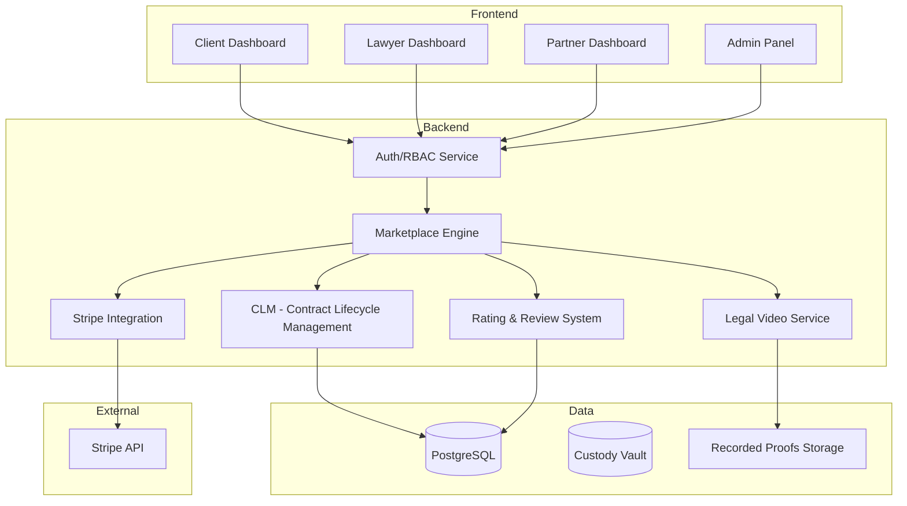

# System Design & Architecture - Marketplace Ecosystem

## Architecture Overview
**What is the high-level system structure?**

## Data Models
**What data do we need to manage?**

- **Profiles**: Extended User model with `role` (CLIENT, LAWYER, PARTNER, ADMIN) and `stripeCustomerId`.
- **Assignments**: Link between `Client`, `Lawyer`, and `Partner` (referral tracking).
- **LegalSessions**: Metadata for video calls (id, participants, status, recording_url).
- **Reviews**: Entity to store ratings (`id`, `fromUserId`, `toUserId`, `sessionId`, `rating` (1-5), `comment`, `createdAt`).
- **Referrals**: Relationship table tracking which `Partner` referred which `Client` or `Lawyer`.
- **FinancialReports**: Read-only views to aggregate referral volume and pending manual payouts for partners.

## API Design
**How do components communicate?**

- `POST /api/checkout/create-session`: Initializes Stripe session for the Client.
- `POST /api/webhooks/stripe`: Listener for payment confirmation (unlocks scheduling).
- `POST /api/sessions/schedule`: Client requests a slot (only after payment).
- `POST /api/sessions/:id/review`: Submit rating and feedback after session.
- `GET /api/lawyers/:id/rating`: Fetch aggregate rating for a professional.
- `GET /api/partner/reports`: Aggregated referral data for dashboard display.

## Component Breakdown
**What are the major building blocks?**

- **Review Module**: Logic to calculate average ratings and display professional history.
- **Stripe Service**: Wrapper for checkout sessions and webhook verification.
- **Partner Reporting Engine**: Query-heavy component to generate statements for offline payouts.
- **Support Form Handler**: Simple API to route no-show reports to Admins.

## Design Decisions
**Why did we choose this approach?**

- **Manual Partner Payouts**: We decided to avoid Stripe Connect complexity in MVP. Partners see reports; Admin pays manually.
- **Payment-First Scheduling**: Scheduling is only allowed *after* a successful Stripe event to prevent lawyer no-shows on unpaid sessions.
- **Immutable Reviews**: Once submitted, reviews cannot be edited by users (only moderation by Admin) to prevent reputation manipulation.

## Non-Functional Requirements
**How should the system perform?**

- **PCI Compliance**: All card data is handled by Stripe. No sensitive financial data reaches our DB.
- **Privacy**: End-to-end encryption for all messages and video metadata.
- **Auditability**: Absolute immutability of session logs and financial attribution.
